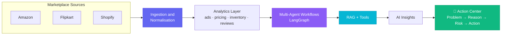

<div align="center">


# Dhanush G

**Junior AI Engineer @ StratAI** · Coimbatore, India

I build agentic AI, RAG and automation systems that run against real marketplace data —<br/>
not demos, not prototypes. Systems that end in an **action**, not a chart.

<p>
<a href="https://www.linkedin.com/in/dhanush-gs/"></a>
<a href="mailto:dhanushgovindhang@gmail.com"></a>
<a href="https://stratai.io"></a>

</p>

</div>

---

## 👨‍💻 About

```yaml
name:        Dhanush G
role:        Junior AI Engineer @ StratAI
experience:  10 months across 3 AI roles
location:    Coimbatore, India
education:   B.E. Artificial Intelligence & Data Science — CGPA 8.6
focus:       [Generative AI, LLMs, RAG, AI Agents, MCP, Automation]
mission:     Build intelligent systems that solve real-world problems.
```

- 🤖 Architecting **multi-agent workflows** with LangChain + LangGraph for autonomous marketplace operations
- 🔎 Building **RAG pipelines** over product catalogues, policy docs and business knowledge bases — grounded answers, or none at all
- 🔌 Wiring models to real systems through **MCP servers and tool integrations**
- ⚙️ Shipping **LLM automation** with n8n, FastAPI and Supabase across Amazon, Flipkart, Shopify & Meesho
- 🎯 I care about **shipping real systems** — every layer verified before the next one is built

---

## 🏗️ How I build AI systems

The request path behind everything I ship:

```mermaid
flowchart LR
    U["👤 User<br/>question or trigger"] --> A["🖥️ Application<br/>dashboard / assistant"]
    A --> API["⚡ API Layer<br/>FastAPI · route handlers"]
    API --> O["🧠 AI Orchestration<br/>context + tool selection"]
    O --> R["📚 RAG / MCP Tools<br/>retrieval · live systems"]
    R --> L["✨ LLM<br/>grounded reasoning"]
    L --> RES["✅ Response<br/>answer or action"]

    style U fill:#6366f1,stroke:#4f46e5,color:#fff
    style O fill:#8b5cf6,stroke:#7c3aed,color:#fff
    style R fill:#06b6d4,stroke:#0891b2,color:#fff
    style L fill:#8b5cf6,stroke:#7c3aed,color:#fff
    style RES fill:#10b981,stroke:#059669,color:#fff
```



### 🛒 Flagship: Marketplace Management Agent

An agentic system that manages seller accounts **end to end** across three marketplaces:



> Every marketplace publishes its own report shapes and grains. The hard part is not the model —
> it is reconciling the data so a metric means the same thing on all three platforms, and refusing
> to produce a confident-looking answer when the underlying data is missing.

---

## 🧰 Tech Stack

**AI & Generative AI**


**Languages & Backend**


**Frontend**


**Data & Automation**


**Cloud & Tooling**


---

## 🚀 Featured Work

| Project | What it does | Stack |
| :--- | :--- | :--- |
| **AI Marketplace Management Agent** | Agentic system managing listings, dynamic repricing and inventory sync across Amazon, Flipkart & Shopify — ending in an AI Action Center with priority and risk scoring | `LangGraph` `LangChain` `FastAPI` `RAG` `PostgreSQL` |
| **Smart Verified RAG Assistant** | FAISS semantic search over real documents plus MCP tools, so the assistant reaches live business systems instead of guessing | `FAISS` `LangChain` `MCP` `FastAPI` |
| **LAKSH Dashboard** | Seller analytics dashboard over a 100+ table PostgreSQL schema, with SKU-level performance views and AI-generated suggestions | `React` `Express` `Vite` `PostgreSQL` |
| **Product Catalog Matching Engine** | Fuzzy-matching pipeline unifying catalogs across Flipkart, Amazon, Shopify and offline shop data into one `product_master` schema | `Python` `PostgreSQL` `Supabase` |
| **LLM Workflow Automation** | Scheduled n8n workflows for price tracking, return-rate monitoring and AI news — LLM processing with structured writes to Supabase | `n8n` `OpenAI` `Telegram` `Supabase` |
| **AI-Powered HR Application** | Internal HR app with dashboard, employee data management and AI-assisted workflows | `Next.js` `TypeScript` `Supabase` |
| **LifeOS** 🚧 | A personal AI operating system, built phase by phase — each phase verified before the next starts | `LLMs` `AI Agents` `Python` |

---

## 💼 Experience

```text
May 2026 → Present    Junior AI Engineer      StratAI          Coimbatore · Onsite
                      Agentic marketplace management · LangGraph multi-agent
                      workflows · LLM repricing engines · RAG · FastAPI

Feb 2026 → Apr 2026   AI Automation Intern    StratAI          Coimbatore · Onsite
                      n8n LLM automation · OpenAI & Telegram integrations
                      price tracking · Supabase pipelines

Nov 2025 → Jan 2026   AI Intern               Soul Creationz   Remote
                      LLM chatbots · RAG Q&A over business documents
                      FastAPI backends · prompt optimisation
```

---

## 📜 Certifications

| Certification | Issuer | Status |
| :--- | :--- | :--- |
| Claude Certified Architect | Anthropic | 🔄 In progress |
| Introduction to Machine Learning & Cloud Computing | NPTEL | ✅ Earned |
| Data Analysis with Python | IBM Cognitive Class | ✅ Earned |
| AI/ML for Geodata Analysis | ISRO | ✅ Earned |
| Career Essentials in Business Analysis | Microsoft & LinkedIn | ✅ Earned |

---

## 🌱 Currently exploring

- Agentic architecture patterns — guardrails, context passing, subagent orchestration
- Advanced MCP server design and multi-tool agent workflows
- Scaling RAG systems over large, messy marketplace datasets

---

## 📊 GitHub Stats

<div align="center">

<picture>
  <source media="(prefers-color-scheme: dark)" srcset="https://github-readme-stats.vercel.app/api?username=Dhanushgs1&show_icons=true&hide_border=true&theme=tokyonight&title_color=6366f1&icon_color=6366f1" />
  
</picture>
<picture>
  <source media="(prefers-color-scheme: dark)" srcset="https://github-readme-stats.vercel.app/api/top-langs?username=Dhanushgs1&layout=compact&hide_border=true&theme=tokyonight&title_color=6366f1" />
  
</picture>

<picture>
  <source media="(prefers-color-scheme: dark)" srcset="https://streak-stats.demolab.com?user=Dhanushgs1&hide_border=true&theme=tokyonight&ring=6366f1&fire=6366f1&currStreakLabel=6366f1" />
  
</picture>

</div>

---

<div align="center">

### 📫 Let us talk

If you are building something with **agents, RAG or MCP** — I would like to hear about it.

<a href="mailto:dhanushgovindhang@gmail.com"></a>
<a href="https://www.linkedin.com/in/dhanush-gs/"></a>

<i>Build intelligent systems that solve real-world problems.</i>

</div>
