<div align="center">


<br/>

I build agentic AI, RAG and automation systems that run against **real marketplace data** —<br/>
not demos, not prototypes. Systems that end in an **action**, not a chart.

<br/>

<a href="https://www.linkedin.com/in/dhanush-gs/"></a>
<a href="mailto:dhanushgovindhang@gmail.com"></a>
<a href="https://stratai.io"></a>
<a href="https://github.com/Dhanushgs1?tab=followers"></a>


</div>


##  &nbsp;About Me

```yaml
name:        Dhanush G
role:        Junior AI Engineer @ StratAI
experience:  10 months across 3 AI roles
location:    Coimbatore, India
education:   B.E. Artificial Intelligence & Data Science — CGPA 8.6
focus:       [Generative AI, LLMs, RAG, AI Agents, MCP, Automation]
mission:     Build intelligent systems that solve real-world problems.
```

<table>
<tr>
<td width="50%" valign="top">

**🤖 What I build**

- Multi-agent workflows with **LangChain + LangGraph**
- **RAG pipelines** over catalogues, policy docs and knowledge bases
- **MCP servers** that wire models to live business systems
- **LLM automation** with n8n, FastAPI and Supabase

</td>
<td width="50%" valign="top">

**🎯 How I work**

- Grounded answers, or **none at all** — no confident guessing
- Every phase **verified** before the next one starts
- Ship **real systems**, not prototypes
- Analysis has to end in a **recommended action**

</td>
</tr>
</table>


## 🏗️ &nbsp;How I Build AI Systems

The request path behind everything I ship:

```mermaid
flowchart LR
    U["👤 User<br/>question or trigger"] --> A["🖥️ Application<br/>dashboard / assistant"]
    A --> API["⚡ API Layer<br/>FastAPI · route handlers"]
    API --> O["🧠 AI Orchestration<br/>context + tool selection"]
    O --> R["📚 RAG / MCP Tools<br/>retrieval · live systems"]
    R --> L["✨ LLM<br/>grounded reasoning"]
    L --> RES["✅ Response<br/>answer or action"]

    style U fill:#6366f1,stroke:#4338ca,stroke-width:2px,color:#fff
    style A fill:#7c3aed,stroke:#6d28d9,stroke-width:2px,color:#fff
    style API fill:#8b5cf6,stroke:#7c3aed,stroke-width:2px,color:#fff
    style O fill:#a855f7,stroke:#9333ea,stroke-width:2px,color:#fff
    style R fill:#06b6d4,stroke:#0891b2,stroke-width:2px,color:#fff
    style L fill:#ec4899,stroke:#db2777,stroke-width:2px,color:#fff
    style RES fill:#10b981,stroke:#059669,stroke-width:2px,color:#fff
```



### 🛒 &nbsp;Flagship — Marketplace Management Agent

An agentic system that manages seller accounts **end to end** across three marketplaces:

```mermaid
flowchart LR
    subgraph SRC["🏬 Marketplace Sources"]
        A1["Amazon"]
        A2["Flipkart"]
        A3["Shopify"]
    end
    SRC --> ING["🔄 Ingestion and<br/>Normalisation"]
    ING --> AN["📊 Analytics Layer<br/>ads · pricing · inventory · reviews"]
    AN --> AG["🕸️ Multi-Agent Workflows<br/>LangGraph"]
    AG --> T["🔌 RAG + MCP Tools"]
    T --> INS["💡 AI Insights"]
    INS --> AC["🎯 Action Center<br/>Problem → Reason → Risk → Action"]

    style A1 fill:#f59e0b,stroke:#d97706,stroke-width:2px,color:#fff
    style A2 fill:#f59e0b,stroke:#d97706,stroke-width:2px,color:#fff
    style A3 fill:#f59e0b,stroke:#d97706,stroke-width:2px,color:#fff
    style ING fill:#6366f1,stroke:#4338ca,stroke-width:2px,color:#fff
    style AN fill:#8b5cf6,stroke:#7c3aed,stroke-width:2px,color:#fff
    style AG fill:#a855f7,stroke:#9333ea,stroke-width:2px,color:#fff
    style T fill:#06b6d4,stroke:#0891b2,stroke-width:2px,color:#fff
    style INS fill:#ec4899,stroke:#db2777,stroke-width:2px,color:#fff
    style AC fill:#10b981,stroke:#059669,stroke-width:2px,color:#fff
```



> [!NOTE]
> Every marketplace publishes its own report shapes and grains. The hard part is not the model —
> it is reconciling the data so a metric means the same thing on all three platforms, and refusing
> to produce a confident-looking answer when the underlying data is missing.


## 🧰 &nbsp;Tech Stack

<div align="center">

**🧠 AI & Generative AI**


**💻 Languages & Backend**


**🎨 Frontend**


**🗄️ Data & Automation**


**☁️ Cloud & Tooling**


</div>


## 🚀 &nbsp;Featured Work

<table>
<tr>
<td width="50%" valign="top">

### 🛒 AI Marketplace Management Agent
Agentic system managing listings, dynamic repricing and inventory sync across **Amazon, Flipkart & Shopify** — ending in an AI Action Center with priority and risk scoring.


</td>
<td width="50%" valign="top">

### 🔎 Smart Verified RAG Assistant
FAISS semantic search over real documents plus **MCP tools**, so the assistant reaches live business systems instead of guessing.


</td>
</tr>
<tr>
<td width="50%" valign="top">

### 📊 LAKSH Dashboard
Seller analytics dashboard over a **100+ table PostgreSQL schema**, with SKU-level performance views and AI-generated suggestions.


</td>
<td width="50%" valign="top">

### 🧬 Product Catalog Matching Engine
Fuzzy-matching pipeline unifying catalogs across Flipkart, Amazon, Shopify and offline shop data into one `product_master` schema.


</td>
</tr>
<tr>
<td width="50%" valign="top">

### ⚙️ LLM Workflow Automation
Scheduled n8n workflows for price tracking, return-rate monitoring and AI news — LLM processing with structured writes to Supabase.


</td>
<td width="50%" valign="top">

### 🧠 LifeOS &nbsp;`in progress`
A personal AI operating system, built phase by phase — each phase verified before the next one starts.


</td>
</tr>
</table>


## 💼 &nbsp;Experience

```text
🟢 May 2026 → Present    Junior AI Engineer      StratAI          Coimbatore · Onsite
                         Agentic marketplace management · LangGraph multi-agent
                         workflows · LLM repricing engines · RAG · FastAPI

🔵 Feb 2026 → Apr 2026   AI Automation Intern    StratAI          Coimbatore · Onsite
                         n8n LLM automation · OpenAI & Telegram integrations
                         price tracking · Supabase pipelines

🟣 Nov 2025 → Jan 2026   AI Intern               Soul Creationz   Remote
                         LLM chatbots · RAG Q&A over business documents
                         FastAPI backends · prompt optimisation
```


## 🌱 &nbsp;Currently Exploring

<div align="center">


</div>


## 📊 &nbsp;GitHub Stats

<div align="center">

<picture>
  <source media="(prefers-color-scheme: dark)" srcset="https://streak-stats.demolab.com?user=Dhanushgs1&hide_border=true&theme=tokyonight&ring=8B5CF6&fire=EC4899&currStreakLabel=06B6D4&sideNums=6366F1&sideLabels=8B5CF6&dates=64748B" />
  
</picture>

<picture>
  <source media="(prefers-color-scheme: dark)" srcset="https://github-profile-summary-cards.vercel.app/api/cards/profile-details?username=Dhanushgs1&theme=github_dark" />
  
</picture>

<picture>
  <source media="(prefers-color-scheme: dark)" srcset="https://github-profile-summary-cards.vercel.app/api/cards/repos-per-language?username=Dhanushgs1&theme=github_dark" />
  
</picture>
<picture>
  <source media="(prefers-color-scheme: dark)" srcset="https://github-profile-summary-cards.vercel.app/api/cards/most-commit-language?username=Dhanushgs1&theme=github_dark" />
  
</picture>

<picture>
  <source media="(prefers-color-scheme: dark)" srcset="https://github-profile-summary-cards.vercel.app/api/cards/productive-time?username=Dhanushgs1&theme=github_dark&utcOffset=5.5" />
  
</picture>

</div>


## 📫 &nbsp;Let Us Talk

<div align="center">

If you are building something with **agents, RAG or MCP** — I would like to hear about it.

<br/><br/>

<a href="mailto:dhanushgovindhang@gmail.com"></a>
<a href="https://www.linkedin.com/in/dhanush-gs/"></a>
<a href="https://github.com/Dhanushgs1"></a>

</div>


